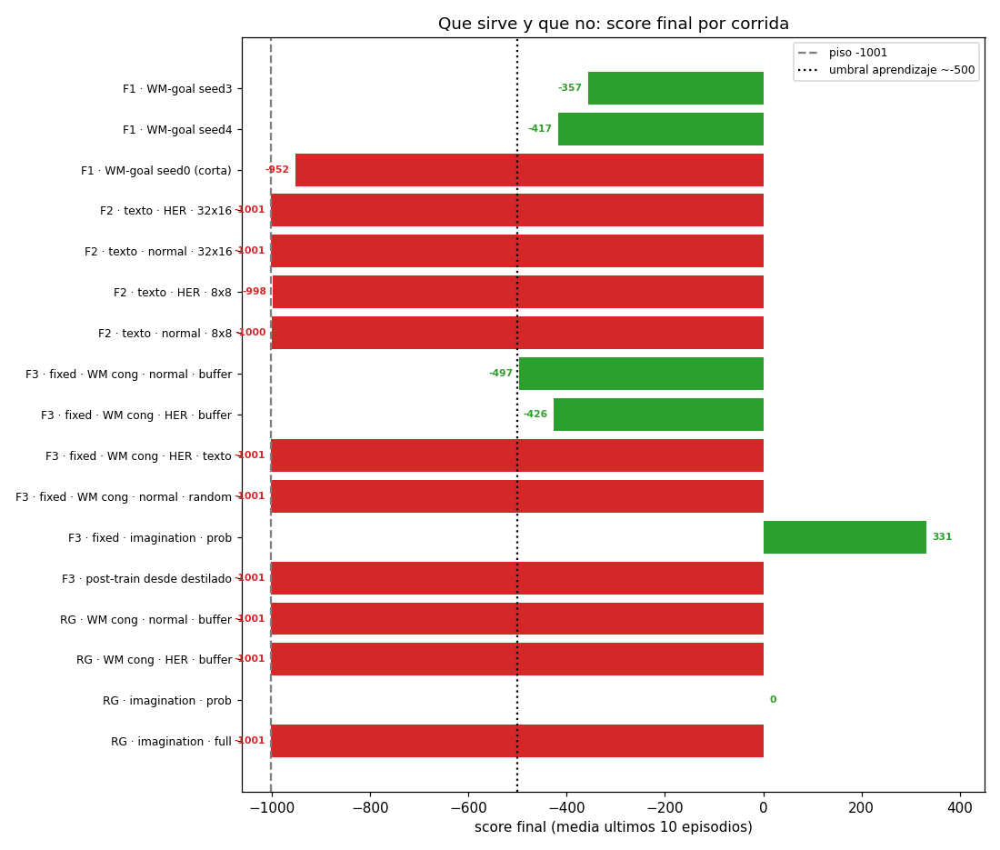
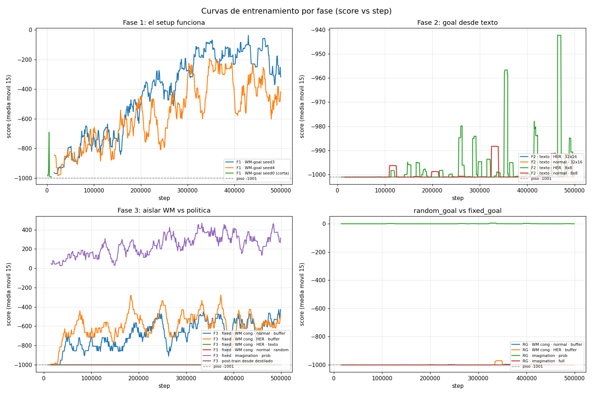
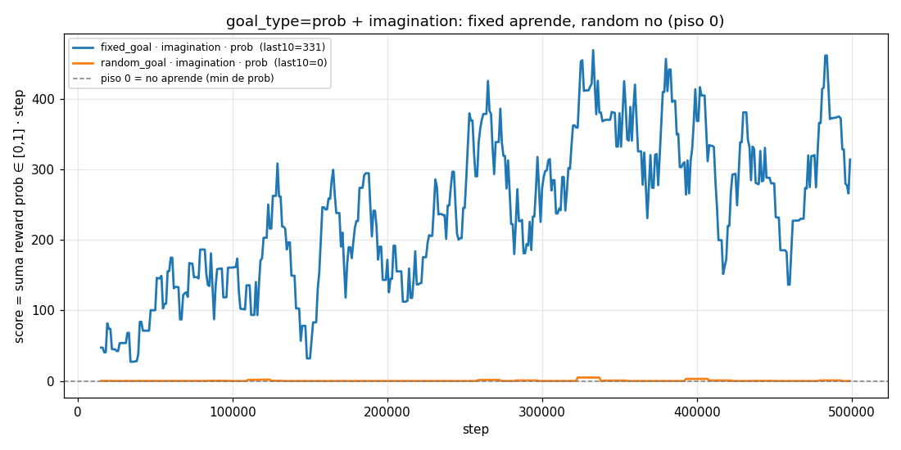

# Experimentos — Goal-conditioned R2-Dreamer con goal latente `z`

Documentación versionada de los experimentos del proyecto: qué se corrió, qué
resultó, **qué sirve y qué no**, con gráficos. Es la contraparte en `git` de la
bitácora personal `bitacora_nano/` (que está en `.gitignore`): aquí se consolida
lo reproducible y presentable.

> **Pregunta de investigación.** ¿Se puede aprender una política
> goal-conditioned sobre un Dreamer cuyo *goal* es un latente discreto `z`
> (32 grupos × 16 categorías), comparándolo contra el `z` del estado imaginado?
> El goal puede venir del buffer, de un encoder de texto que describe la misión,
> o de la imaginación del world-model.

## Cómo leer esta carpeta

| Documento | Contenido |
|---|---|
| [`fase1_primera_row_alcanzable.md`](fase1_primera_row_alcanzable.md) | Prueba preliminar: la **primera fila** del `z` **sí se puede alcanzar** y la política aprende cuando el goal sale del posterior del WM (seeds 3/4 → -357/-417). |
| [`fase2_goal_desde_texto.md`](fase2_goal_desde_texto.md) | Mover la fuente del goal al text-encoder rompe el aprendizaje (todo a -1001). **Pendiente:** rehacer estos experimentos en **fixed_goal** (se corrieron en random_goal, que ya falla por sí solo y confunde el resultado). |
| [`fase3_posttrain_wm_aleatorio.md`](fase3_posttrain_wm_aleatorio.md) | Post-train sobre un WM entrenado con acciones aleatorias: **congelar el WM sí ayuda** a los resultados. **Falta** una corrida **sin** congelar el WM para medir el salto de diferencia. |
| [`hallazgo_goal_type_full.md`](hallazgo_goal_type_full.md) | **Un bloqueante de mucho peso** (sobre todo con goal de **texto**/random): `goal_type=full` (sample==sample sobre 32 grupos) es inalcanzable por construcción (P≈4e-13). No universal: con goal del **buffer**, fixed_goal sí aprende con `full`. |
| [`random_goal_vs_fixed_goal.md`](random_goal_vs_fixed_goal.md) | Por qué post-train funciona en fixed_goal y falla en random_goal: la posición del verde vive en `z`/`deter`. Incluye `goal_sample=imagination`. |
| [`recompensa_prob_funciona.md`](recompensa_prob_funciona.md) | Recompensa densa `prob` + goal de imaginación → aprende en **fixed_goal** (+331), pero **no** en random_goal (se clava en el piso 0). El gap fixed↔random sigue abierto. |
| [`analisis_trayectorias_crafter.md`](analisis_trayectorias_crafter.md) | Inspección de los `z` a lo largo de rollouts reales: en ambientes **complejos** (crafter) los `z` son **muy estocásticos** (entropía ≈1.96/4 bits, 48% de grupos difusos), mientras que en **fixed_goal** tienden a ser **mucho más deterministas**. Abre la pregunta de cuánta información útil vive en `z` vs en `h`. |
| [`diagnosticos_espacio_representacion.md`](diagnosticos_espacio_representacion.md) | Las herramientas de `experiments/` (estocasticidad del WM/text, consistencia del posterior). |

## La historia en una línea

El reward `z(estado) == z(goal)` **es entrenable** (Fase 1; y `goal_type=full`
con goal del buffer aprende en fixed_goal → el match exacto **no** es imposible).
Lo que lo rompe es exigir match **exacto sobre los 32 grupos** cuando el goal
viene de una fuente que produce goals inalcanzables (texto, random,
cross-posición). Una recompensa **densa** (`goal_type=prob`) sobre un goal
**alcanzable por construcción** (`goal_sample=imagination`) **no desbloquea**
nada nuevo en **fixed_goal** —que **ya aprendía desde antes** (post-train con
`full`+buffer llega a ≈-426/-497)— y **tampoco** mueve a **random_goal**, que
sigue **clavado en el piso 0**. Persiste un **gap grande entre fixed_goal y random_goal** que es la
pregunta abierta central: la misma receta funciona en uno y falla en el otro.

## Tabla maestra de corridas

Score = media de los últimos 10 episodios (piso = **-1001**, el time-limit sin
alcanzar el goal; en `crafter` la escala es otra). 🟢 = aprende, 🔴 = pegado al piso.

| Corrida | Env | goal_sample | goal_type | buffer | Steps | Score final | Máx | |
|---|---|---|---|---|---|---|---|:--:|
| `goal_dreamer_with_text/03` (seed 3) | random | buffer (1ª fila) | first_row† | normal | 499k | **-357** | -7 | 🟢 |
| `goal_dreamer_with_text/04` (seed 4) | random | buffer (1ª fila) | first_row† | normal | 499k | **-417** | -9 | 🟢 |
| `goal_dreamer_with_text/01` (seed 0) | random | buffer (1ª fila) | first_row† | normal | 9k | -952 | -691 | ⏸ corta |
| `text_goal_sample_her_buffer/01` | random§ | text | full | HER | 499k | -1001 | -1001 | 🔴 |
| `text_goal_sample_normal_buffer/01` | random§ | text | full | normal | 499k | -1001 | -1001 | 🔴 |
| `text_goal_sample_8x8_goal_her_buffer/01` (RSSM 8×8) | random§ | text | full | HER | 499k | -998 | -121 | 🔴 |
| `text_goal_sample_8x8_normal_buffer/01` (RSSM 8×8) | random§ | text | full | normal | 499k | -1000 | -811 | 🔴 |
| `wm_only_random_mission/01` | fixed | — | — | — | 499k | -1001 (esperado) | — | ⚙ solo WM |
| `post_train_from_wm_only/her_buffer_goals` | fixed | buffer | full | HER | 499k | **-426** | -240 | 🟢 |
| `post_train_from_wm_only/normal_buffer_goals` | fixed | buffer | full | normal | 499k | **-497** | -245 | 🟢 |
| `post_train_from_wm_only/normalbuf_randomgoal/01` | fixed | random | full | normal | 499k | -1001 | -1001 | 🔴 |
| `post_train_from_wm_only/herbuf_textgoal/01` | fixed | text | full | HER | 499k | -1001 | -1001 | 🔴 |
| `distill_text_from_wm_only/01` | fixed | — | full | — | 199k | (text_kl≈41.7) | — | ⚙ destila texto |
| `post_train_from_distill/01` | fixed | text | full | HER | 499k | -1001 | -1001 | 🔴 |
| `random_goal/wm_only_randomgoal/01` | random | — | — | — | 499k | -1001 (esperado) | — | ⚙ solo WM |
| `random_goal/...frozenwm_herbuf_goalbuf/01` | random | buffer | full | HER | 499k | -1001 | -637 | 🔴 |
| `random_goal/...frozenwm_normalbuf_goalbuf/01` | random | buffer | full | normal | 499k | -1001 | -942 | 🔴 |
| `random_goal/...frozenwm_normalbuf_goalimag/01` | random | imagination | full | normal | 499k | -1001 | -1000 | 🔴 |
| **`post_train_from_wm_only/04_imag_prob/01`** | **fixed** | **imagination** | **prob**‡ | normal | 499k | **+331** | +727 | 🟢 |
| **`random_goal/...frozenwm_normalbuf_goalimag_prob/01`** | **random** | **imagination** | **prob**‡ | normal | 499k | **0** (piso) | +73 | 🔴 |
| `original_wm_crafter/02` (baseline vanilla) | crafter | — | — | — | 1.01M | eval≈10.9 | 14.1 | 🟢 WM juega |
| `z_without_history_wm_crafter/01` (ablación) | crafter | — | — | — | 1.01M | eval≈8.7 | 12.1 | 🟢 −13% |

> † Las corridas `goal_dreamer_with_text/*` (abr-28) son **anteriores** a que
> existieran los keys `goal_type`/`goal_sample`: corrieron con el reward de
> **primera fila** hardcodeado (`stoch[:, 0]`), no con `full`. El equivalente
> actual es `goal_type=first_row`. Verificado contra su `.hydra/config.yaml`.
> Detalle en [fase1](fase1_el_setup_funciona.md).
>
> ‡ Las corridas `goal_type=prob` están en **otra escala**: el score es la suma
> de la recompensa de probabilidad ∈ [0,1], con **piso 0** (no -1001). Ahí
> **0 = no aprende** (mínimo), no éxito. Por eso no son comparables con las demás
> y van en su propia figura ([recompensa_prob](recompensa_prob_funciona.md)).
>
> § Las corridas `text_goal_sample_*` (Fase 2) se lanzaron en **`random_goal`**
> (verificado vs `.hydra/config.yaml`), no en fixed_goal. Su -1001 está
> **confundido**: random_goal + `full` ya falla por sí solo (sin texto), así que
> no aíslan al text encoder. Detalle en [fase2](fase2_goal_desde_texto.md).

## Figuras de conjunto

Generadas por [`scripts/plot_runs.py`](scripts/plot_runs.py) a partir de los
eventos de TensorBoard. Re-ejecutar con `uv run python3
docs/experimentos/scripts/plot_runs.py` cuando lleguen corridas nuevas.

### Qué sirve y qué no — score final por corrida

Solo corridas con reward ∈ {-1, 0} (piso -1001), comparables entre sí. Las
corridas `prob` están en otra escala y se grafican aparte (abajo).

### Curvas de entrenamiento por fase

### Corridas `goal_type=prob` (escala propia, piso 0)

Aquí **0 = no aprende**. fixed_goal despega; random_goal se queda en el piso.

## Reproducibilidad

- Los comandos exactos de cada corrida están en
  [`../../execution_commands.md`](../../execution_commands.md) (numerados).
- Cada corrida guarda su config compuesta en `<logdir>/.hydra/config.yaml`:
  **ese** es el registro de verdad de sus hiperparámetros, no los defaults
  actuales.
- Las figuras de diagnóstico (`experiments/`) se regeneran con los scripts de
  `experiments/` sobre el checkpoint correspondiente; ver
  [`diagnosticos_espacio_representacion.md`](diagnosticos_espacio_representacion.md).
