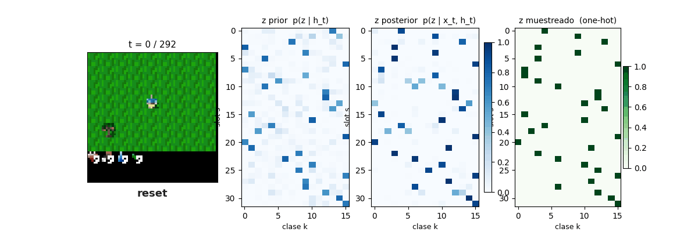

# Análisis de trayectorias en crafter — ¿qué tan estocástico es el `z`?

[← Índice](README.md)

## Qué se miró

Una trayectoria real del WM base de crafter (`logdir/original_wm_crafter/02`,
seed 0, 292 pasos hasta `done`). Para cada paso se guardó la imagen, la acción,
y las distribuciones del latente discreto: el **posterior** `q(z | h, obs)` y el
**prior** `p(z | h)`, ambos de forma `(32 grupos × 16 categorías)`.

> El `.gif` es la trayectoria original
> (`logdir/original_wm_crafter/02/trajectories/Pareciera_funcionar/trajectory.gif`,
> copiado a `assets/`). El agente explora, recolecta y craftea; la escena cambia
> de bioma y de contenido todo el tiempo.

## El `z` es muy estocástico

Métricas sobre los 293 pasos de la trayectoria (máxima entropía por grupo =
`log2(16) = 4` bits):

| Métrica | Posterior | Prior |
|---|---:|---:|
| Entropía media por grupo (bits) | **1.96** | 2.49 |
| Probabilidad de pico media (`max_k p_k`) | **0.55** | 0.44 |
| Fracción de grupos "confiados" (pico > 0.9) | **11%** | — |
| Fracción de grupos "difusos" (pico < 0.5) | **48%** | — |
| Acuerdo de `argmax` paso-a-paso (posterior consecutivos) | **52%** | — |
| Acuerdo de `argmax` prior↔posterior | **54%** | — |

Lecturas:

- **Casi la mitad de los 32 grupos están difusos** (pico < 0.5) en un paso
  típico: el WM no se "compromete" con una categoría. Solo ~1 de cada 9 grupos
  está realmente confiado.
- **El `z` no es estable en el tiempo**: entre dos pasos consecutivos el `argmax`
  de cada grupo cambia ~48% de las veces. Parte es contenido real (la escena
  cambia), pero parte es ruido de muestreo.
- **El prior predice poco al posterior**: ver la observación mueve el `argmax`
  de casi la mitad de los grupos respecto a lo que el prior esperaba. Es decir,
  el `z` lleva información que `h` por sí solo no anticipaba… o ruido.

Esto contrasta con **fixed_goal**, donde la escena es estable y el `z` es
**mucho más determinista** (picos altos, poca rotación temporal): la
estocasticidad escala con la complejidad/variabilidad del ambiente. Esto está
**ratificado** por varios diagnósticos de [`experiments/`](../../experiments/)
—en particular `WM_stochasticity_state.py` (estocasticidad del posterior del WM)
y `state_traj_consistency.py` (consistencia del posterior a lo largo de
trayectorias)— que miden un `z` notablemente más concentrado y estable en los
ambientes goal-grid que en crafter.

## ¿Por qué es tan estocástico el `z` en crafter?

Hipótesis, no excluyentes:

1. **El mundo es genuinamente más entrópico.** Crafter tiene biomas, criaturas,
   inventario, día/noche y mucho parcialmente observable. Un posterior bien
   calibrado *debe* ser incierto sobre lo que no ve; la entropía alta es la
   respuesta correcta, no una falla.
2. **32×16 es mucha capacidad para repartir.** Con 512 bits nominales de latente,
   puede que el WM distribuya la señal en muchos grupos poco confiados en vez de
   pocos grupos nítidos. Eso da entropía media alta sin que falte información.
3. **Barlow Twins no premia decisión, premia decorrelación.** `r2dreamer` no
   reconstruye; el objetivo de representación no fuerza al posterior a colapsar
   a one-hots. Nada empuja al `z` a ser puntiagudo.
4. **Posible ruido / grupos muertos.** Una fracción de los grupos difusos podría
   no estar codificando nada útil: ruido que el resto de la red aprende a
   ignorar.

## La pregunta de fondo: ¿cuánta información valiosa hay en `z` vs en `h`?

El feature que ven actor/crítico y las funciones de reward es
`get_feat = flatten(z) ++ h`. Si el `z` es tan ruidoso, vale la pena preguntarse
**cuánto aporta realmente** frente al estado determinista `h` (`deter`):

- Quizá **casi toda la información útil ya vive en `h`**, y el `z` aporta sobre
  todo el muestreo estocástico necesario para imaginar futuros diversos — útil
  para el world-model, pero **mala señal para comparar goals**. Esto encaja con
  el hallazgo central del proyecto: comparar `z(estado) == z(goal)` sobre los 32
  grupos es frágil justamente porque el `z` no es estable ni determinista
  (ver [`hallazgo_goal_type_full.md`](hallazgo_goal_type_full.md)).
- Si `h` carga la información, entonces **anclar el goal en `z`** es atacar la
  parte ruidosa del estado. Valdría la pena explorar goals/recompensas definidos
  (también o en cambio) sobre `h`, o sobre el `argmax`/prior en vez de muestras.

### Diagnósticos propuestos

Para cuantificar esto (no hechos aún):

- **Ablación de features:** entrenar/evaluar la política o el reward con solo `h`,
  solo `z`, y `z++h`. Si solo-`h` ≈ `z++h`, el `z` aporta poco a la política.
- **Sondas lineales (linear probes):** predecir variables del estado de crafter
  (posición, inventario, bioma) desde `h` vs desde `z`. ¿Dónde vive cada cosa?
- **Mutual information / decodabilidad** de la acción o la recompensa real desde
  `z` vs `h`.
- **Grupos muertos:** medir qué grupos del `z` tienen entropía alta *constante*
  (nunca se comprometen) — candidatos a no codificar nada.

## Reproducir

Los arreglos están en
`logdir/original_wm_crafter/02/trajectories/Pareciera_funcionar/arrays.npz`
(keys: `post_probs`, `post_z`, `prior_probs`, `prior_z`, `images`, `actions`;
todos con `T=293`). Las métricas de arriba se calculan sobre `post_probs` /
`prior_probs` con entropía en base 2 por grupo. La trayectoria se generó con las
utilidades de replay de `tools/`/`viz/`.
