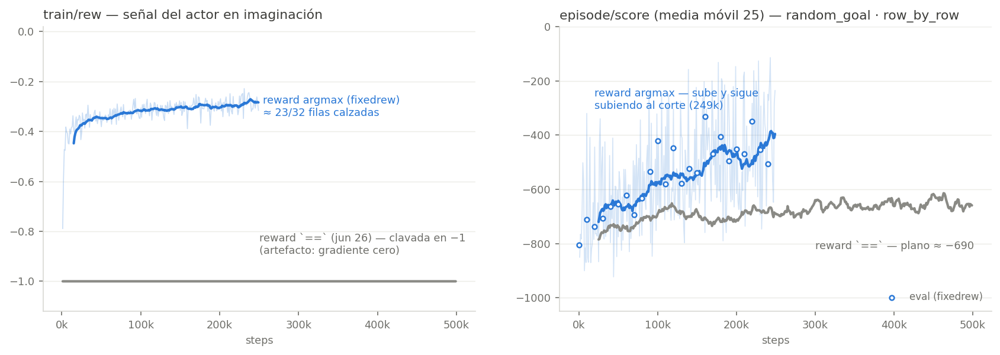

# El artefacto del reward exacto en GPU — y el primer aprendizaje en random_goal (jun 28 → jul 7)

[← Índice](README.md)

Este documento cierra dos historias a la vez: un **bug de cómputo** que invalidó
parte de las conclusiones de junio, y el resultado de arreglarlo — **la primera
corrida de random_goal que aprende**.

## El síntoma (28 jun)

En el post-train `random_goal/posttrain_randomstart_goalimag_rowbyrow/01`
(item 27 extendido: WM randomstart congelado, `goal_sample=imagination`,
`goal_type=row_by_row`, HER, 500k), el `train/rew` — la recompensa imaginada,
**la señal de gradiente del actor/critic** — quedó clavado en -1.0 todo el run.
Pero `row_by_row` es densa: `(filas calzadas / 32) − 1`, y el `episode/score`
del mismo run era denso (~-686 ≈ 11 filas calzadas por paso). Un -1.0 exacto
significa **cero filas calzadas en todo el batch de imaginación** (16×64×16 =
16384 entradas), por debajo incluso del azar (~2 filas por entrada).

Réplica fiel del pipeline en CPU con el mismo checkpoint: `imag_reward ≈ -0.65`,
**no** -1. Los únicos valores distintos logueados (-1.0, -0.999998, -0.999996,
-0.999994; pasos de 2e-6 = exactamente 1 fila sobre el batch completo) confirman
que el paso de entrenamiento en GPU computaba un limpio ~0 calces.

## La causa y el fix

`rewards.py` comparaba los one-hots (tensores float por diseño — el
straight-through Gumbel necesita floats para los gradientes) con **`==` exacto**.
Esa comparación es frágil: basta que en el grafo compilado (torch.compile
reduce-overhead + autocast fp16) un 1.0 llegue como 0.9995 para que todo deje de
calzar. El assert de validación (ver abajo) mostró que los tensores **sí** son
one-hots dentro de 1e-3 — o sea el contenido está sano; lo que se rompe es la
igualdad exacta de floats.

**Fix (commit `025f3b3`):** `first_row`/`row_by_row`/`full`/`argmax_full` ahora
comparan **índices de argmax** (`_mode_idx()`) — semánticamente idéntico para
one-hots, inmune a perturbaciones de precisión/grafo. Incluye un assert de
one-hot gateado por `VALIDATE_ONEHOT` (default activo; **poner
`VALIDATE_ONEHOT=0` en runs de producción** porque fuerza syncs que rompen
cudagraphs).

## Datación: el artefacto es del código, no del entorno

Pregunta obligada: si el `==` estaba roto, ¿cómo aprendió fixed_goal con `full`
en mayo? Revisando el `train/rew` **guardado** de todas las corridas:

| Corrida | Fecha | goal_type | train/rew | ¿`==` funcionaba? |
|---|---|---|---|---|
| fixed `{her,normal}_buffer_goals` | mayo | full | -0.99 → -0.55, continuo (~470 valores) | ✅ sí |
| random `frozenwm_{her,normal}buf_goalbuf` | jun 8 | full | -1.0 … -0.95, **con matches reales** | ✅ sí |
| random `frozenwm_normalbuf_goalimag` | jun 16 | full | -1.0 exacto | ambiguo† |
| random `posttrain_randomstart_goalimag_full` (item 27) | jun 24 | full | -1.0 exacto | ambiguo† |
| random `posttrain_randomstart_goalimag_rowbyrow` | jun 26 | row_by_row | -1.0 (4 valores) vs -0.65 real | ❌ **artefacto probado** |

> † Para `full` sample==sample, -1 plano es lo esperado *genuinamente* (match de
> 32 grupos ≈ 0, hallazgo 06-16), así que esos runs no distinguen bug de diseño.

Conclusiones de la tabla:

1. **fixed_goal no se salvó por ser fixed_goal**: sus runs corrieron en mayo con
   código donde el `==` aún funcionaba.
2. **El artefacto entró entre el 8 y el 26 de junio** — la ventana del refactor
   grande (unificación de `train.py`, PR #47, 22 jun) y los cambios HER/logit
   (17–20 jun).
3. **Rehabilita el diagnóstico cross-posición**: los -1001 de random_goal con
   goal de buffer (jun 8) eran genuinos — su `==` funcionaba y había ~1 match
   por batch. Lo único contaminado por el bug es la rama `row_by_row` del
   item 27.

## La validación A/B (item 28, corrida 3 jul)

Tres runs cortos (20k) de la receta rowbyrow: (A) reward `==` + compile,
(B) `==` sin compile, (C) argmax + compile + assert. Resultado: **los tres
brazos salieron sanos e indistinguibles** (train/rew -0.81 → -0.33). El assert
**nunca saltó** — los tensores llegan como one-hots válidos incluso compilados
(nota: el assert solo escribe algo cuando *falla*; silencio = pasó).

Confound descubierto post-hoc: el commit del fix aterrizó **3 minutos antes**
de que arrancara el brazo A, y los tres corrieron espalda-con-espalda desde un
lanzador — lo más probable es que **los tres corrieran el código ya arreglado**
y A/B nunca ejecutaran el `==` viejo. La causa exacta (compile vs otra cosa)
queda sin clavar; en la práctica es discutible que importe: el fix elimina la
fragilidad de raíz y quedó validado bajo `compile=True`.

## El resultado: random_goal aprende por primera vez

Relanzamiento de la receta exacta del item 27-rowbyrow, solo con el reward
arreglado (`posttrain_randomstart_goalimag_rowbyrow_fixedrew/01`):

| Métrica | Inicio | 249k (corte) |
|---|---|---|
| `train/rew` | -0.47 | **-0.28** (≈23/32 filas en imaginación) |
| `episode/score` (ma25) | -732 | **-396, todavía subiendo** (mejor episodio -114) |
| `eval_score` | -805 | ~-450 (mejor **-332** @160k) |

Es la **primera corrida de random_goal que despega del piso con cualquier
receta**. La conclusión del item 27 ("random_goal no aprende ni ampliando el
WM") queda invertida para la rama de match exacto: era el artefacto, no la
estructura del entorno.

### Matices para no sobrevender

- **`episode/length` = 1000 siempre, por diseño**: `random_goal.py` fuerza
  `terminated=False`; llegar al verde no corta el episodio. El score es la única
  señal de progreso.
- **El agente NO navega al cuadrado verde** (verificado en los videos: en eval
  parte al lado del verde y se aleja). Está resolviendo correctamente lo que la
  recompensa pide — matchear el `z` del goal imaginado (~15 pasos de random walk
  desde el spawn), que **no codifica la tarea del verde**. Las filas de `z` que
  reflejan la posición del verde calzan "gratis" todo el episodio (el verde no
  se mueve dentro del episodio); las que guían el comportamiento son las de pose
  del agente.
- O sea: lo que quedó demostrado es que **la maquinaria goal-condicionada en
  latente funciona en random_goal**. El eslabón pendiente es una fuente de goal
  que sí pida el verde — el candidato natural es `goal_sample=image` (ya
  fusionado, sin correr) con esta misma receta.
- El run **murió silenciosamente a 249k/500k** (2.13 h, sin error en el log —
  SIGKILL/OOM/sesión cortada) y no dejó `latest.pt`. Relanzamiento a `/02`
  pendiente (con `nohup`/`tmux`).

## Cola actualizada

| Pendiente | Nota |
|---|---|
| Relanzar fixedrew `/02` a 500k completos | misma receta, `VALIDATE_ONEHOT=0`, en tmux |
| `goal_sample=image` + `row_by_row` en random_goal | conecta el goal latente con la tarea del verde |
| Réplica con `seed=2` | afirmar el primer-aprendizaje |
| Confirmar en barto qué `rewards.py` corrió el A/B | cierra (o no) la causa compile |
| Revisitar Fase 2 (texto) con el reward arreglado | `first_row`/`row_by_row` en fixed_goal |
