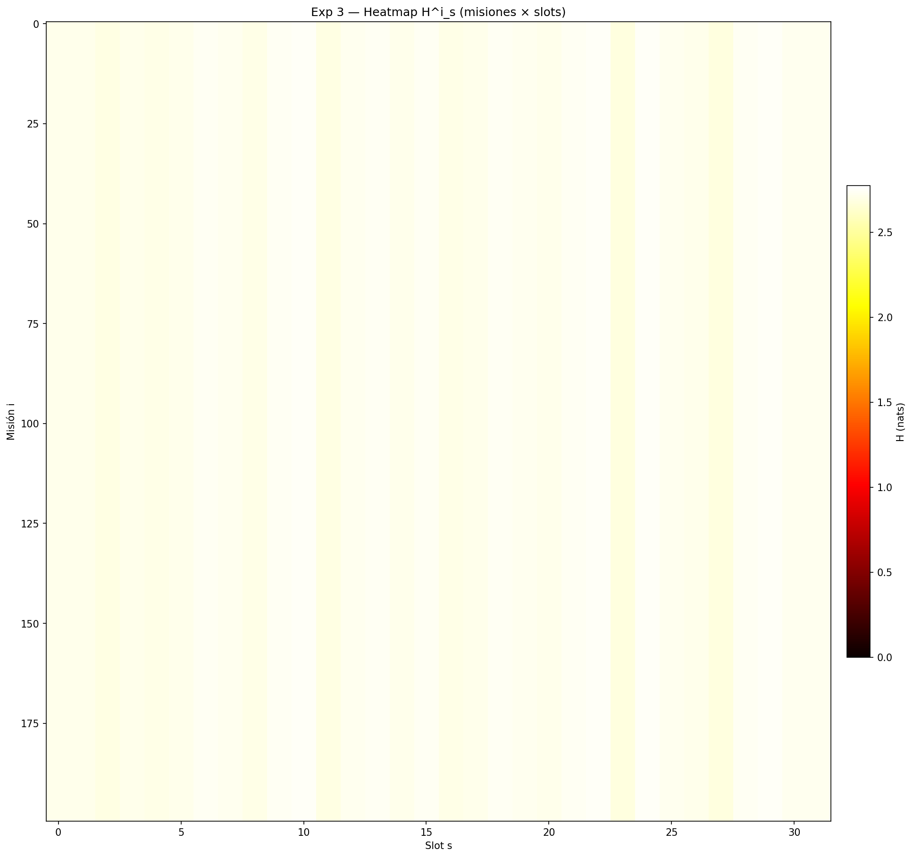
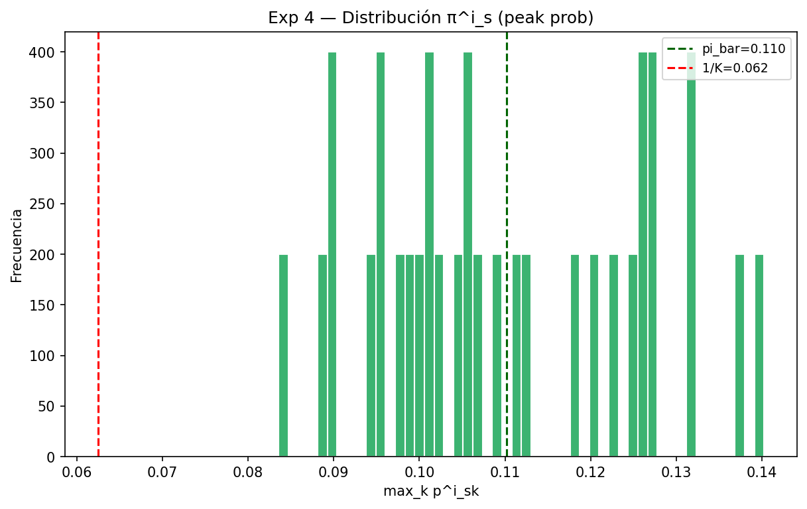
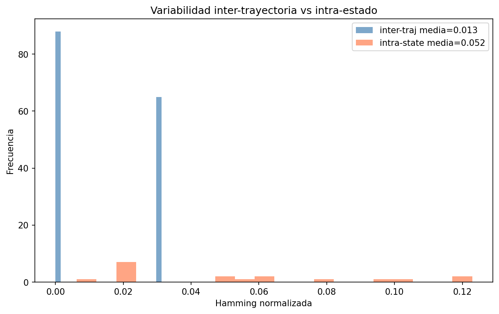
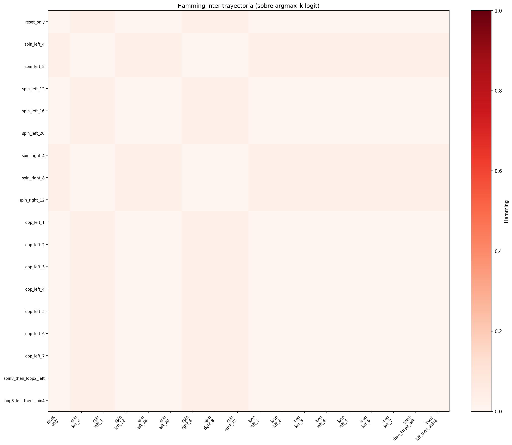
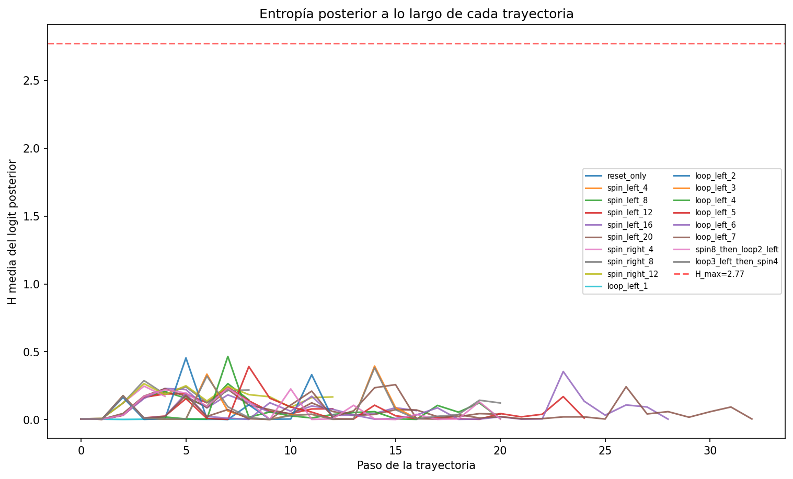

# Diagnósticos del espacio de representación (`experiments/`)

[← Índice](README.md)

Como las corridas no aprendían, el foco se movió de "¿qué hiperparámetro toco?"
a **debuggear el espacio latente**: ¿es el posterior del WM consistente y
determinista lo suficiente como para que un reward `z == z_goal` tenga sentido?
Estas son las herramientas que respondieron esa pregunta, con sus figuras.

## 1. Estocasticidad del WM y del text encoder

- **`WM_stochasticity_state.py`** — ¿cuánta varianza inyecta el Gumbel-Softmax en
  el posterior del WM para un **mismo** estado?
- **`text_stochasticity_state.py`** — la misma pregunta para el text encoder:
  ¿da `z` consistentes a misiones equivalentes?

El text encoder resultó ser **difuso** (entropía por slot alta) comparado con el
WM, que es casi determinista en los slots informativos:





Esta difusión es lo que hace ruidoso el goal derivado de texto (colapsa 94
misiones sobre 7 de 16 clases en el slot 0; ver
[hallazgo_goal_type_full](hallazgo_goal_type_full.md)).

## 2. Consistencia del posterior entre trayectorias

**`state_traj_consistency.py`** (mtime 22 may) — la prueba más directa de si el
reward function es viable: ¿llegar al **mismo estado físico** desde trayectorias
distintas produce el **mismo** `z` posterior? Si no, el reward `z == z_goal` es
inestable por construcción.







Prerequisito de confianza para estos experimentos: el check de **determinismo de
replay** (`61daadc`) que verifica que reproducir una trayectoria guardada da el
mismo resultado.

## 3. Alineación text ↔ WM sobre rollouts reales

**`text_wm_alignment.py`** (`9bef55b`, 1 jun) — el experimento que faltaba:
empareja sobre rollouts reales cada `obs["mission"]` con el posterior del WM del
**mismo paso** y lo compara contra `q_text(z|mission)`. Las visualizaciones
previas medían la estocasticidad del text encoder y del WM **por separado**,
nunca alineadas sobre el mismo condicionamiento. Es el origen del
[hallazgo central](hallazgo_goal_type_full.md).

Artefactos: `logdir/distill_text_from_wm_only/01/experiments/text_wm_align/`.

## 4. ¿Codifica `z` la posición del verde?

**`goal_position_in_z.py`** (`1af7cc1`, 12 jun) — documentado en
[random_goal_vs_fixed_goal](random_goal_vs_fixed_goal.md): 16 de 32 slots son
sensibles a la posición del cuadrado verde, lo que vuelve inalcanzable el match
z-full cruzado-en-posición en `random_goal`.

## 5. ¿Es alcanzable un goal de imaginación?

**`goal_reachability.py`** (06-16) — documentado en
[random_goal_vs_fixed_goal](random_goal_vs_fixed_goal.md): el goal imaginado es
alcanzable como estado (~26/32 grupos) pero no como muestra de `z` (match
completo 0% por Gumbel).

## 6. ¿Usa `z` la historia? (rama `feat/original-dreamer-wm`)

Ablación `model.rssm.post_use_deter` (`831f76c`): con `False`, el posterior
condiciona **sólo en el embedding del frame**, no en `deter`. Sobre Crafter
vanilla:

| Run | posterior | eval_score |
|---|---|---|
| `original_wm_crafter/02` | con historia `[deter, embed]` | ≈ 10.9 |
| `z_without_history_wm_crafter/01` | sólo frame | ≈ 8.7 |

Quitar la historia cuesta ~13% pero el encoder por-frame igual aprende a jugar
Crafter — coherente con que buena parte del estado (incluida la posición) se
apoya en `deter`, no sólo en el `z` instantáneo.

## Cómo regenerar estas figuras

Cada script vive en `experiments/` y se corre sobre el checkpoint
correspondiente, p.ej.:

```bash
uv run python3 experiments/goal_position_in_z.py \
    load_from=./logdir/random_goal/wm_only_randomgoal/01
```

La salida queda bajo `<logdir>/experiments/<nombre>/`. Las copias versionadas
para esta documentación están en [`assets/`](assets/) (porque `logdir/` está en
`.gitignore`).
