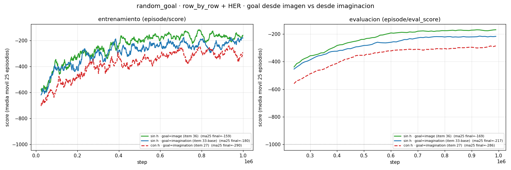

# `goal_sample=image` — atar el goal latente a la tarea real (jul 30)

[← Índice](README.md)

> **Actualización (ago 3).** Esta receta con `her_strategy=future` en vez de
> `final` mejora a **ma25 −91 / eval −126** (item 40) y es la nueva mejor corrida
> del proyecto; los números de abajo son los de la corrida original con `final`.
> Ver [her_future_vs_final](her_future_vs_final.md).

El pendiente #1 de la cola —"la palanca con más retorno esperado"
([artefacto §matices](artefacto_reward_exacto_gpu.md))— ya corrió. Contexto: la
receta ganadora (`row_by_row` + `goal_sample=imagination` + HER, sin `h`)
**aprende** en `random_goal`, pero lo que aprende es a alcanzar el `z` de un
random-walk imaginado de 15 pasos, que **no codifica el cuadrado verde**: en los
videos el agente persigue su pose y se aleja del verde. `goal_sample=image`
existe justamente para cerrar ese hueco.

## Qué hace `goal_sample=image`

Al inicio de cada episodio, el wrapper `GoalImageObservation`
(`envs/wrappers.py`) renderiza —con un `FixedGoal` auxiliar
(`envs.goal_image.GoalImageGenerator`)— la **observación de un estado sintético**:
el cuadrado verde en la celda-goal de *este* episodio y el agente en una celda
al azar. El WM congelado la codifica a `z` con **un paso de posterior** desde el
estado inicial (`Dreamer.encode_observation`), y ese `z` es el goal.

La diferencia de fondo con `imagination`: el goal ya **no** es "un estado
cualquiera alcanzable", es "el estado que muestra el verde donde está el verde".
Está diseñado para `random_goal`, donde los goals del buffer codifican la
posición equivocada ([random_goal_vs_fixed_goal](random_goal_vs_fixed_goal.md)).

## La corrida (item 36)

Post-train sobre el **WM congelado sin `h`** `wm_only_randomstart_no_deter/01`,
`random_goal`, `agent_start_random=True`, `row_by_row`, HER, seed 1, 1M pasos —
idéntico al mejor run del proyecto salvo `env.goal_sample=image` en vez de
`imagination`.

| Métrica (1M, seed 1) | **`goal=image`** (item 36) | `goal=imagination` sin `h` | `goal=imagination` con `h` (item 27 `/03`) |
|---|---|---|---|
| `episode/score` ma25 final | **−159** | −180 | −290 |
| `episode/score` últimos 10 | **−132** | −135 | −280 |
| mejor episodio | −27 | **−22** | −117 |
| `eval_score` ma25 final | **−169** | −217 | −286 |
| `eval_score` mejor | **−97** | −121 | −220 |
| `train/rew` últimos 10 | **−0.13** (≈28/32 filas) | −0.14 (≈27/32) | −0.22 (≈25/32) |

Velocidad (ma25 del `episode/score`, misma métrica en los tres):

| ma25 @ | 143k | 250k | 500k | 1M |
|---|---|---|---|---|
| **`goal=image`** | −389 | −301 | **−188** | **−159** |
| `imagination` sin `h` | −397 | −292 | −275 | −180 |
| `imagination` con `h` | −530 | −395 | −387 | −290 |



**Lectura:** cambiar la fuente del goal **no cuesta nada** y en la segunda mitad
del entrenamiento **despega** (−188 vs −275 a 500k). Es la mejor corrida del
proyecto en `random_goal` por score de entrenamiento **y** de evaluación, y la
brecha es mayor en `eval` (−169 vs −217) que en train — justo lo que uno
esperaría si el goal es más consistente entre episodios.

## El matiz importante: los scores no son 100% comparables

`episode/score` mide **la recompensa `row_by_row` contra el goal de esa
corrida**, y cada corrida tiene una fuente de goal distinta. Un goal desde imagen
y un goal desde imaginación **no tienen la misma dificultad a priori**, así que
el −159 vs −180 **no** prueba por sí solo "image es mejor que imagination":
prueba que con `image` el problema **sigue siendo aprendible**, al menos igual de
bien, con un goal que ahora sí codifica dónde está el verde.

Lo que **sí** es directamente comparable dentro de esta corrida:

- La curva **sube** de −600 a −159 (no está en el piso ni plana): el goal desde
  imagen es alcanzable y da gradiente.
- `train/rew` llega a **≈28/32 filas**, el mejor de todos los runs de
  `row_by_row` — la política calza más del goal en imaginación que con cualquier
  otra fuente.
- No aparece el plateau temprano del run con `h` (que se aplanaba desde ~700k a
  −290); aquí a 1M todavía hay pendiente.

## Lo que esto todavía **no** demuestra

**Que el agente navegue al cuadrado verde.** Eso es la hipótesis que motiva
`image`, pero el `episode/score` no la mide: sigue siendo la distancia en `z`,
no "llegó al verde". Para confirmarlo hacen falta dos cosas que quedan
pendientes:

1. **Ver el `eval_video.mp4`** de esta corrida y compararlo con el de
   `posttrain_randomstart_no_deter_rowbyrow/01` (donde el agente se aleja del
   verde). Es la evidencia más barata y directa.
2. **`experiments/goal_observation_eval.py`** (merge #62, `feat/goal-observation-eval`):
   evalúa con la política si el modelo alcanza posiciones predefinidas. Es
   exactamente la métrica de tarea real que falta.

Mientras eso no se corra, el enunciado honesto es: *el goal ahora **contiene**
la posición del verde por construcción, y la política aprende contra él tan bien
o mejor que antes* — no *el agente va al verde*.

## Pendientes de esta rama

| Pendiente | Nota |
|---|---|
| `eval_video.mp4` del item 36 vs el de `imagination` | ¿cambió el comportamiento o sigue persiguiendo pose? |
| `goal_observation_eval.py` sobre este checkpoint | métrica de tarea real (alcanzar celdas), no de `z` |
| Replicar en más seeds (hoy 1) | la receta `imagination` sin `h` está igual de flaca: 1 seed hasta que bajen los items 33-34 |
| Espejo **con `h`** de esta corrida | aísla si `image` también ayuda con `h`, o si sólo compone con el posterior observacional |
| `image` + `full` | ¿el goal desde imagen destraba el match exacto? (con `imagination` no: [item 38](posterior_sin_deter.md)) |

## Comando (del `execution_commands.md`, item 36)

```bash
bash scripts/train.sh \
    load_from=./logdir/random_goal/wm_only_randomstart_no_deter/01 \
    logdir=./logdir/random_goal/posttrain_no_deter_rowbyrow_goalimage/01 \
    freeze_wm=True wm_only=False \
    env=random_goal seed=1 mission_text=False \
    env.agent_start_random=True env.goal_sample=image \
    buffer=her goal_type=row_by_row \
    model.rssm.obs_use_deter=False \
    env.steps=1000000 trainer.update_log_every=1000
```
