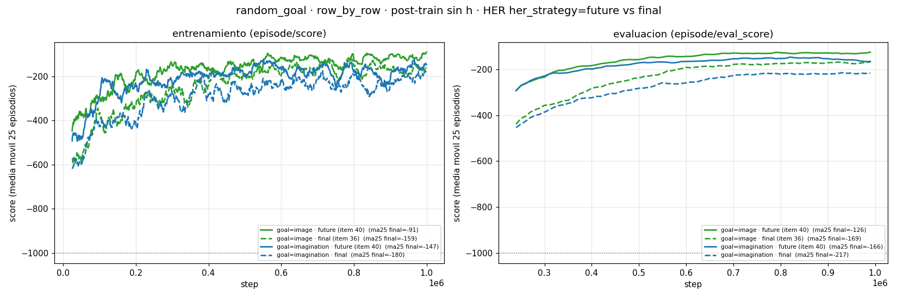

# HER `her_strategy=future` vs `final` (ago 2-3)

[← Índice](README.md)

Todas las corridas con HER del proyecto usaron `her_strategy: final` — el default
de `configs/buffer/her.yaml`, nunca revisado. El item 40 corre el A/B contra
`future` sobre las **dos** mejores recetas de `random_goal`, y **`future` gana en
las dos, por márgenes grandes**: es la mejor corrida del proyecto
(`goal=image` + `future`: eval ma25 **−126** vs −169) y, sobre todo, **aprende
mucho más rápido** (a 143k ya está donde `final` llega recién a ~500k).

## Por qué se esperaba que ganara

`FINAL` reetiqueta el goal al `z` del **último** paso del episodio. Con
`env.time_limit=1000` y episodios que casi nunca terminan antes (el piso −1001
es el time-limit), ese goal queda a **cientos de pasos** del estado muestreado —
muy lejos del `imag_horizon=15` sobre el que se calcula la recompensa en
imaginación. HER original (Andrychowicz 2017) usaba episodios de ~50 pasos,
donde "final" sí está cerca.

Y hay un segundo efecto, más fuerte, visible en `HERBuffer._sample_goal`
(`her_dream/buffers/her_buffer.py`): los índices son vectores de largo `T+1`
(`batch_length=64`), así que

- con `FINAL` (`transition_indices_in_episode = ep_length - 1`) los **65 pasos de
  la secuencia comparten el mismo goal**;
- con `FUTURE` (`randint(current, ep_length)` por paso) **cada paso recibe su
  propio goal futuro**.

Con `batch_size=16` y `her_ratio=0.8` eso es la diferencia entre ~13 goals
distintos por batch y ~830. Además `future` da un currículum natural de
dificultad (el rango incluye el propio estado → recompensa ≈0, hasta el final del
episodio), y es el análogo on-policy de `goal_sample=imagination`
("un estado alcanzable desde acá").

## Las corridas (item 40)

Post-train sobre el WM congelado **sin `h`** `wm_only_randomstart_no_deter/01`,
`random_goal`, `agent_start_random=True`, `row_by_row`, HER, 1M pasos. Cada par
es un A/B de una sola variable: `diff` de los `.hydra/config.yaml` de cada par
devuelve **exactamente dos líneas**, `her_strategy` y `logdir`.

| Corrida | goal | HER | seed | score ma25 | últimos 10 | mejor ep. | `eval` ma25 | `eval` mejor | `train/rew` |
|---|---|---|---|---|---|---|---|---|---|
| `posttrain_no_deter_rowbyrow_goalimage_herfuture/01` | image | **future** | 1 | **−91** | **−99** | −25 | **−126** | **−78** | **−0.12** |
| `posttrain_no_deter_rowbyrow_goalimage/01` (item 36) | image | final | 1 | −159 | −132 | −27 | −169 | −97 | −0.13 |
| `posttrain_randomstart_no_deter_rowbyrow_herfuture/01` | imagination | **future** | 3 | **−147** | −128 | −24 | **−166** | −97 | −0.14 |
| `posttrain_randomstart_no_deter_rowbyrow/01` | imagination | final | 3 | −180 | −135 | −22 | −217 | −121 | −0.14 |



## Hallazgo 1 — la ganancia grande es de **velocidad**, no de techo

`episode/score` ma25:

| ma25 @ | 143k | 250k | 500k | 750k | 1M |
|---|---|---|---|---|---|
| image · **future** | **−211** | **−213** | **−144** | **−146** | **−91** |
| image · final | −389 | −301 | −188 | −185 | −159 |
| imagination · **future** | **−268** | **−236** | **−201** | −248 | **−147** |
| imagination · final | −397 | −292 | −275 | −267 | −180 |

`episode/eval_score` ma25 (más limpio: las curvas de train con `row_by_row`
oscilan mucho, ver la figura):

| ma25 @ | 143k | 250k | 500k | 750k | 1M |
|---|---|---|---|---|---|
| image · **future** | **−346** | **−270** | **−158** | **−131** | **−126** |
| image · final | −507 | −414 | −238 | −178 | −169 |
| imagination · **future** | **−341** | **−272** | **−172** | **−154** | **−166** |
| imagination · final | −506 | −439 | −283 | −222 | −217 |

A **143k** pasos `future` ya está en el nivel que `final` alcanza recién entre
400k y 500k: **~3× más rápido**, en las dos recetas y en train y eval a la vez.
Es exactamente la firma que predice el mecanismo (diversidad de goals por
gradiente), no la de un techo distinto — al final del run la brecha se achica
(imagination: −166 vs −217) aunque no se cierra.

## Hallazgo 2 — el A/B es **directamente comparable** (a diferencia de los otros)

El caveat que arrastran casi todas las comparaciones de esta carpeta —"los scores
sólo son comparables a igual `goal_type` y misma fuente de goal", porque el score
mide la recompensa contra *ese* goal— **no aplica acá**. `her_strategy` sólo
afecta el **reetiquetado del batch de entrenamiento**; el goal del entorno, la
recompensa evaluada y la tarea son idénticos. El −126 vs −169 es una comparación
de manzanas con manzanas, sobre la misma seed y el mismo WM congelado.

## Hallazgo 3 — compone con `goal_sample=image`

Las dos palancas son ortogonales y se suman: `image` mejoraba sobre
`imagination` con `final` (−169 vs −217 en eval) y sigue mejorando con `future`
(−126 vs −166). El mejor resultado del proyecto en `random_goal` es hoy
**`goal=image` + `future`**: eval ma25 **−126**, train ma25 **−91**,
`train/rew` ≈ **28.0/32 filas**.

## Matices

- **1 seed por brazo** (image: seed 1; imagination: seed 3). La consistencia
  entre las dos recetas y entre train y eval es el argumento fuerte, no la
  replicación.
- **Sigue midiendo distancia en `z`**, no "llegó al cuadrado verde". Vale el
  mismo pendiente que [goal_desde_imagen](goal_desde_imagen.md): video y
  `experiments/goal_observation_eval.py`. Los `latest.pt` de las dos corridas ya
  están bajados localmente.
- **La curva de train de `imagination · future` tiene un bache a 750k** (−248,
  peor que su propio 500k). Con `row_by_row` la ma25 de train oscila decenas de
  puntos; la lectura seria es la curva de eval.
- **No se probó `future` acotado a una ventana** (`t + U[1, 50]`). Con episodios
  de 1000 pasos, `future` uniforme deja el goal a ~cientos de pasos en promedio:
  la ganancia observada viene de la diversidad, no de que los goals queden
  cerca. Una ventana corta ataca lo segundo y **no está implementado** (serían
  ~3 líneas en `_sample_goal`).
- **`episode` (la tercera estrategia) sigue sin probarse.**
- Costo: 12.8 h (imagination) y 9.9 h (image) en una A6000, sin diferencia
  apreciable de `fps` contra sus controles.

## ¿Cambiar el default?

`configs/buffer/her.yaml` sigue con `her_strategy: final`. Con 2/2 recetas a
favor y un mecanismo claro, lo razonable es **cambiar el default a `future`**;
queda pendiente decidirlo para no invalidar la comparabilidad con las corridas
históricas (todas corrieron con `final`).

## Comandos (del `execution_commands.md`, item 40)

```bash
# imagination + future (A/B contra posttrain_randomstart_no_deter_rowbyrow/01)
bash scripts/train.sh \
    load_from=./logdir/random_goal/wm_only_randomstart_no_deter/01 \
    logdir=./logdir/random_goal/posttrain_randomstart_no_deter_rowbyrow_herfuture/01 \
    freeze_wm=True wm_only=False \
    env=random_goal seed=3 mission_text=False \
    env.agent_start_random=True env.goal_sample=imagination \
    buffer=her buffer.her_strategy=future goal_type=row_by_row \
    model.rssm.obs_use_deter=False \
    env.steps=1000000 trainer.update_log_every=1000

# image + future (A/B contra el item 36), idéntico salvo goal_sample/seed/logdir
bash scripts/train.sh \
    load_from=./logdir/random_goal/wm_only_randomstart_no_deter/01 \
    logdir=./logdir/random_goal/posttrain_no_deter_rowbyrow_goalimage_herfuture/01 \
    freeze_wm=True wm_only=False \
    env=random_goal seed=1 mission_text=False \
    env.agent_start_random=True env.goal_sample=image \
    buffer=her buffer.her_strategy=future goal_type=row_by_row \
    model.rssm.obs_use_deter=False \
    env.steps=1000000 trainer.update_log_every=1000
```
