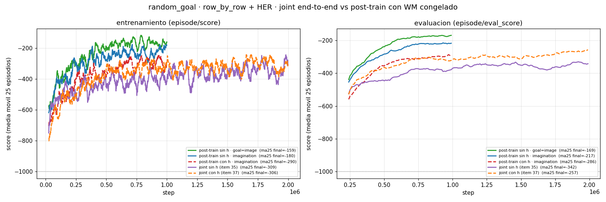

# Joint end-to-end vs post-train con WM congelado (jul 29-30)

[← Índice](README.md)

Pendiente de larga data del README ("Joint desde 0"): todas las corridas que
aprenden en `random_goal` son **post-trains sobre un WM congelado**. ¿La
separación WM → política **ayuda** o sólo era comodidad experimental? Los items
35 y 37 corren la receta ganadora **end-to-end** (sin `load_from`, sin
`freeze_wm`: WM + actor/critic juntos desde cero), con el doble de pasos (2M)
porque el WM también tiene que aprender. Y como vienen en par —uno sin `h`, otro
con `h`— dan además un **A/B limpio de `obs_use_deter` en el régimen joint**.

## Corridas

`random_goal`, `agent_start_random=True`, `goal_sample=imagination`,
`goal_type=row_by_row`, HER, seed 1. Los post-trains son la referencia de 1M
sobre el WM `randomstart` congelado.

| Corrida | `h` | modo | Steps | score ma25 | últimos 10 | mejor ep. | `eval` ma25 | `eval` mejor | `train/rew` |
|---|---|---|---|---|---|---|---|---|---|
| `posttrain_no_deter_rowbyrow_goalimage/01` (item 36)† | sin | post-train | 1M | **−159** | −132 | −27 | **−169** | −97 | −0.13 |
| `posttrain_randomstart_no_deter_rowbyrow/01` | sin | post-train | 1M | **−180** | −135 | −22 | −217 | −121 | −0.14 |
| `posttrain_randomstart_goalimag_rowbyrow/03` (item 27) | con | post-train | 1M | −290 | −280 | −117 | −286 | −220 | −0.22 |
| `joint_no_deter_rowbyrow/01` (item 35) | sin | **joint** | 2M | −309 | −333 | −14 | **−342** | −214 | −0.20 |
| `joint_rowbyrow/01` (item 37) | con | **joint** | 2M | −306 | −336 | −20 | **−257** | −161 | −0.19 |

> † `goal_sample=image` en vez de `imagination`; va como referencia del techo
> actual, no como parte del A/B ([goal_desde_imagen](goal_desde_imagen.md)).



## Hallazgo 1 — el joint **no** supera al post-train, ni con el doble de pasos

Con 2M de pasos (vs 1M), ambos joints se quedan en ma25 ≈ **−306/−309**, por
debajo del post-train sin `h` (**−180**) y a la par del post-train con `h`
(−290). Y no es que les falte horizonte: a 1M el joint ya iba en −418 (sin `h`)
y −302 (con `h`), y el segundo millón casi no mueve la aguja.

| ma25 @ | 143k | 250k | 500k | 1M | 2M |
|---|---|---|---|---|---|
| joint sin `h` | −472 | −503 | −434 | −418 | −309 |
| joint con `h` | −488 | −526 | −323 | −302 | −306 |
| post-train sin `h` | −397 | −292 | −275 | **−180** | — |
| post-train con `h` | −530 | −395 | −387 | −290 | — |

**Congelar el WM ayuda**, o al menos no estorba: la política aprende mejor sobre
una representación estacionaria. Tiene sentido mecánicamente — con
`goal_sample=imagination` el goal **lo genera el WM**, así que en el joint la
política persigue un blanco que se mueve mientras el WM entrena (co-adaptación),
y encima la recompensa `row_by_row` se define contra un latente que va cambiando
de significado.

Esto **cierra el pendiente "Joint desde 0"** del README, con la respuesta
contraria a la sospecha: la separación WM → política no era una muleta, es parte
de por qué funciona.

## Hallazgo 2 — la ventaja de quitar `h` **no se traslada** al joint

Este es el resultado que acota el hallazgo de
[posterior_sin_deter](posterior_sin_deter.md). En post-train, quitar `h` mejoraba
todo (−180 vs −290, y ~2-3× más rápido). En joint, **el A/B se empata en train y
se invierte en eval**:

| Joint (2M, seed 1) | sin `h` (item 35) | con `h` (item 37) |
|---|---|---|
| `episode/score` ma25 | −309 | −306 |
| `eval_score` ma25 | **−342** | **−257** |
| `eval_score` mejor | −214 | −161 |
| `train/rew` | −0.20 | −0.19 |

En entrenamiento son indistinguibles; en **evaluación** el de `h` es ~85 puntos
mejor y sostenido (ver la figura: la curva naranja va por encima de la morada
todo el run). O sea: **con `h` generaliza mejor cuando el WM también entrena**.

La lectura conjunta con el post-train: el beneficio de un `z` puramente
observacional es de **comparabilidad del goal contra un encoder fijo**. Si el
encoder se está moviendo, esa ventaja se diluye y vuelve a pesar lo que `h`
aporta —capacidad para modelar/jugar— que es exactamente lo que mostraba la
ablación de crafter (−13% de reward al quitar `h`,
[diagnosticos §6](diagnosticos_espacio_representacion.md)).

**Enunciado corregido:** *quitar `h` ayuda al post-train sobre un WM congelado*,
no *quitar `h` ayuda*, sin más.

## Matices

- **1 seed por brazo.** Los dos joints son seed 1; el A/B de eval (−257 vs −342)
  es una diferencia grande y sostenida, pero no está replicado.
- **Los joints ven 2M de pasos, los post-trains 1M** — y aun así pierden. La
  comparación favorece al joint en presupuesto y aun así el post-train gana, así
  que la conclusión es robusta en ese sentido. Lo que **no** se puede afirmar es
  el costo total real: el post-train arrastra además el 1M de pasos del WM-only
  (`wm_only_randomstart_no_deter/01`), así que en pasos-totales el joint (2M)
  compite contra 1M + 1M = 2M. Empatan en presupuesto y el post-train rinde más.
- **El WM del joint no es el mismo WM.** Entrena con datos on-policy (la política
  goal-condicionada), no con acciones aleatorias: `loss/barlow` termina en ~106
  (con `h`) / ~115 (sin `h`) vs 38/47 de los WM-only. No son WM equivalentes con
  distinta receta de política; son dos WM distintos.
- El `train/rew` del joint (≈ −0.19/−0.20, ~26/32 filas) queda entre el
  post-train con `h` (−0.22) y el sin `h` (−0.14).

## Comandos (del `execution_commands.md`, items 35 y 37)

```bash
# 35) joint sin h
bash scripts/train.sh \
    logdir=./logdir/random_goal/joint_no_deter_rowbyrow/01 \
    env=random_goal seed=1 mission_text=False \
    env.agent_start_random=True env.goal_sample=imagination \
    buffer=her goal_type=row_by_row \
    model.rssm.obs_use_deter=False \
    env.steps=2000000 trainer.update_log_every=1000

# 37) joint con h (idéntico, sin la línea de obs_use_deter)
bash scripts/train.sh \
    logdir=./logdir/random_goal/joint_rowbyrow/01 \
    env=random_goal seed=1 mission_text=False \
    env.agent_start_random=True env.goal_sample=imagination \
    buffer=her goal_type=row_by_row \
    env.steps=2000000 trainer.update_log_every=1000
```
