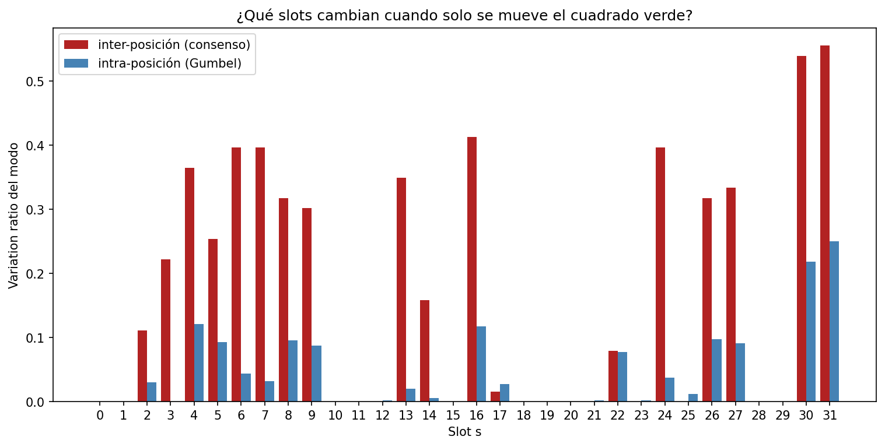
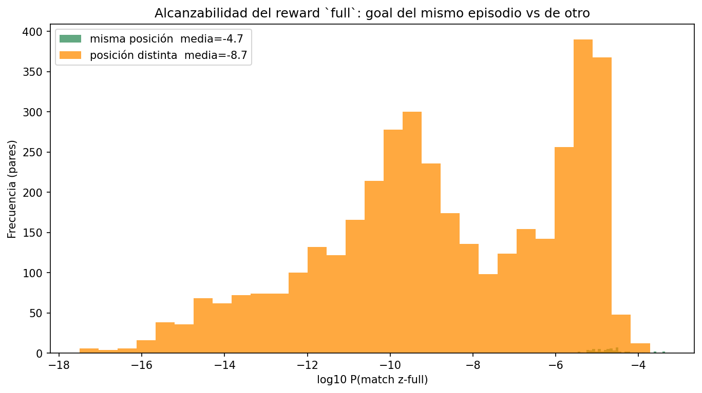
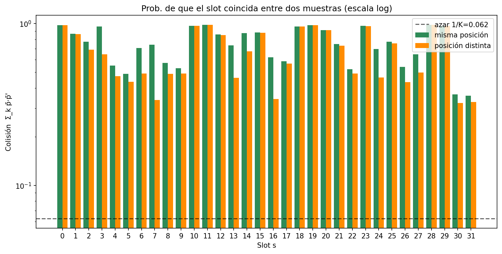
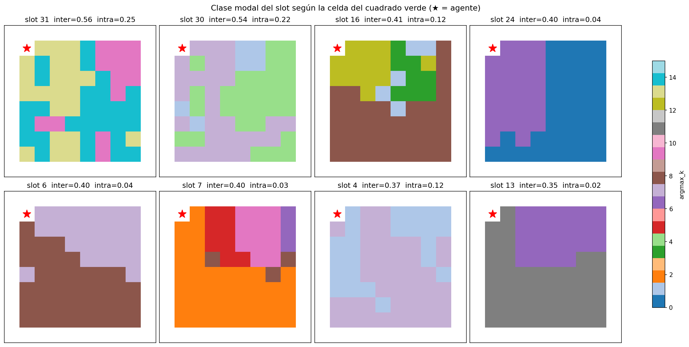
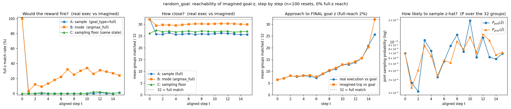

# random_goal vs fixed_goal — la posición del verde vive en `z`/`deter` (jun 8 → jun 16)

[← Índice](README.md)

## El contraste a explicar

Con la **misma receta** (WM congelado + `goal_type=full` + `goal_sample=buffer`):

- **`fixed_goal`** → el post-train **aprende** (≈ -426 / -497).
- **`random_goal`** → se queda en **-1001**.

| Corrida (random_goal, WM congelado, 500k) | goal_sample | buffer | Score |
|---|---|---|---|
| `random_goal/...frozenwm_herbuf_goalbuf/01` | buffer | HER | -1001 |
| `random_goal/...frozenwm_normalbuf_goalbuf/01` | buffer | normal | -1001 |

La única diferencia entre los dos entornos: en `fixed_goal` el cuadrado verde
**no se mueve** entre episodios; en `random_goal` salta a una celda aleatoria.

## Hipótesis: `z` codifica la posición del verde

Si algunos slots de `z` codifican *dónde* está el verde, entonces un goal de
buffer (de un episodio donde el verde estaba en **otra** celda) es inalcanzable
por construcción con `full`: esos slots nunca van a coincidir con el episodio
actual.

## Experimento `goal_position_in_z.py` (commit `1af7cc1`, 12 jun)

Como FixedGoal y RandomGoal generan observaciones idénticas, se usa FixedGoal
barriendo **las 63 posiciones interiores** del verde, con pose del agente y
secuencia de acciones fijas, tomando el posterior del último paso con **R=8
repeticiones** (semillas de Gumbel) para separar variación *inter-posición* de
*intra-posición*.

### Resultado: sí codifica posición

| Métrica | Valor |
|---|---|
| Slots sensibles a posición (inter ≫ intra) | **16 de 32** |
| log10 P(match z-full) **misma** posición | **-4.68** |
| log10 P(match z-full) posición **distinta** | **-8.72** |

La mitad de los grupos de `z` cambian con la celda del verde. El match z-full
contra un goal de otra posición es **~4 órdenes de magnitud** más improbable que
contra la misma (log10 -8.7 vs -4.7).

Mapas espaciales de los slots más sensibles (cómo varía la activación del slot
con la celda del verde):

### Conclusión

En `random_goal`, el goal de buffer vive en una posición distinta → 16 slots
nunca coinciden → reward siempre -1 → **-1001 por construcción**. En `fixed_goal`
el verde no se mueve, esos 16 slots sí coinciden y la receta funciona. **Causa
raíz del contraste confirmada.**

## Matiz (06-16): la posición vive sobre todo en `deter`, no en `z`

Un probe posterior (z→posición vs deter→posición) midió ~0.25 de precisión desde
`stoch` vs **~0.91 desde `deter`**. O sea: la posición se apoya sobre todo en la
parte **determinista** del estado. Pero los slots de `z` que *sí* la reflejan
(esos 16) bastan para volver inalcanzable el match z-full cruzado-en-posición.
Como `full` sólo compara `z`, el match es en gran parte **ciego al verde** y, a
la vez, **roto** por los pocos slots que sí lo codifican.

Esto conecta con la ablación de Crafter (`feat/original-dreamer-wm`): quitarle al
posterior el condicionamiento en `deter` (`post_use_deter=False`) cuesta ~13% de
reward (eval 9.9 → 8.7) pero el encoder por-frame igual aprende — coherente con
que buena parte del estado (incluida la posición) se apoya en `deter`.

## La respuesta de diseño: `goal_sample=imagination`

Si el goal de buffer es inalcanzable porque viene de otra posición, generemos un
goal **alcanzable por construcción desde el episodio actual**: al inicio del
episodio se rueda el WM (prior) `imag_horizon` pasos desde la obs inicial con
**acciones uniformes aleatorias** y se toma el `z` prior final como goal
(`Dreamer.imagine_goal`, commits `8eb4dcc` / `0da1ba2`).

### Pero con `goal_type=full` tampoco aprende

| Corrida | goal_sample | goal_type | Score |
|---|---|---|---|
| `random_goal/...frozenwm_normalbuf_goalimag/01` | imagination | full | **-1001** |

### Experimento `goal_reachability.py` (06-16) — por qué

Se ejecutan en el **entorno real** las mismas 15 acciones que generaron el goal
imaginado (oráculo = mejor plan posible) y se mide cuántos de los 32 grupos
one-hot de `z` coinciden, en tres lentes:

| | A: sample (`full`) | B: mode (`argmax_full`) | C: floor de muestreo |
|---|---|---|---|
| grupos/32 (t≥1) | ~25–26 | ~30 | ~26–27 |
| **match completo** | **0%** | **8–36%** | **0%** |
| reachability del goal final | 26.8/32, **0/200 exacto** | — | — |

**Conclusión.** El goal imaginado es alcanzable como **estado** (~26/32 grupos, y
el verde se preserva ~60–65%), pero **inalcanzable como muestra de `z`**. La
columna C es la prueba dura: dos muestras del **mismo** estado matchean 0%
completo → el ruido de Gumbel cambia ~6 grupos. Así que `goal_type=full`
(sample==sample) da -1 siempre, sin importar la navegación → -1001. Es **el mismo
muro** del [hallazgo central](hallazgo_goal_type_full.md), ahora por la varianza
de muestreo en vez de por la divergencia text↔WM.

La salida intentada: comparar **modas** (`argmax_full`, hasta ~36% alcanzable) o
usar una recompensa **densa por probabilidad** (`prob`). La recompensa `prob` +
goal de imaginación **sí desbloquea fixed_goal** (+331), pero en **random_goal
sigue sin aprender** (se clava en el piso 0). Es decir: ni siquiera con goal
alcanzable por construcción y reward denso se cierra el gap en random_goal. Ver
[recompensa_prob_funciona](recompensa_prob_funciona.md).

## El gap fixed_goal ↔ random_goal sigue abierto

Dos recetas, mismo patrón: `full`+buffer y `prob`+imagination **ambas aprenden en
fixed_goal y fallan en random_goal**. La fuga de la posición del verde a `z`
explica el caso `full`+buffer (goal de otra posición), pero **no** el caso
`prob`+imagination (donde el goal es alcanzable por construcción desde el episodio
actual). Queda una diferencia de fondo entre los dos entornos —más allá de la
posición— **todavía no entendida**, y es la pregunta abierta principal.
