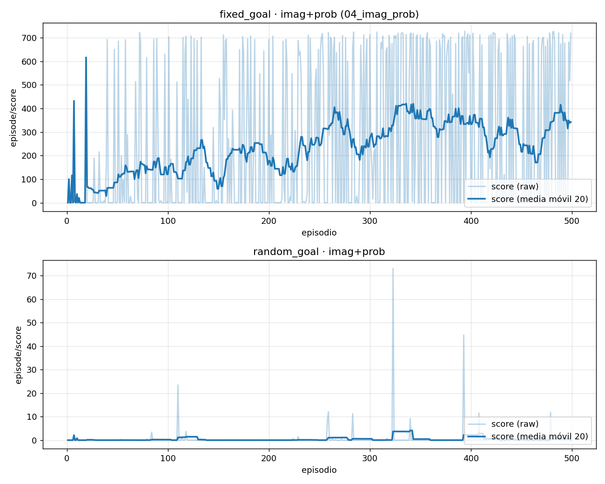

# Recompensa densa `prob` + goal de imaginación — funciona en fixed_goal, **no** en random_goal

[← Índice](README.md)

> ⚠️ **Corrección (2026-06-20).** Una versión anterior de este documento decía que
> `prob` aprendía "en ambos entornos" leyendo el score 0 de random_goal como
> éxito. **Es al revés:** con `goal_type=prob` el score logueado es la **suma de
> la recompensa de probabilidad** ∈ [0,1] por paso, así que su **piso es 0** (no
> -1001). Un score de 0 = **mínimo = no aprende**. random_goal se queda en 0.

## La recompensa `prob` y su escala

`goal_type=prob` (`prob_reward` en `rewards.py:131`):

```python
def prob_reward(dist, goal):
    return dist.log_prob(goal).exp().unsqueeze(-1)   # ∈ [0, 1] por paso
```

Es la probabilidad de muestrear exactamente el goal bajo la distribución del
estado actual — densa, sin umbral. **Implicación clave para leer los gráficos:**
el `episode/score` de estas corridas es la suma de esa recompensa sobre los pasos
del episodio, en **[0, ~1000]**:

- **0 = piso = no aprende** (probabilidad ~0 todo el episodio).
- valores altos = la política mantiene estados de alta probabilidad bajo el goal.

Esto **no es comparable** con el score de las corridas `full`/`first_row` (reward
∈ {-1, 0}, piso **-1001**, éxito ≈ 0). Por eso las corridas `prob` van en su
propia figura.

## Resultados (verificados sobre la curva completa)

| Corrida | Env | buffer | Score final (last10) | Máx | Trayectoria (media móvil 25) | |
|---|---|---|---|---|---|:--:|
| `post_train_from_wm_only/04_imag_prob/01` | **fixed_goal** | normal | **+331** | +727 | sube desde temprano: ~137 a los 70k → ~385 a los 380k, plateau ~350 (promedio global 238) | 🟢 aprende |
| `random_goal/...goalimag_prob/01` | **random_goal** | normal | **0** | 72.9 | media móvil ~0 todo el run (promedio global 0.5; el 72.9 fue un pico aislado) | 🔴 no aprende |


(Figura anterior del usuario, misma conclusión: )

## Lecturas

1. **En fixed_goal, `prob` + `imagination` sí desbloquea el aprendizaje** — y de
   forma progresiva desde temprano (media móvil ~137 ya a los 70k, plateau ~350).
   Es el primer caso que aprende con un goal **de imaginación** (los de `full` se
   quedaban en -1001).
2. **En random_goal no aprende**: se queda clavado en el piso 0 de la recompensa.
   El goal imaginado existe y la recompensa es densa, pero igual no hay señal
   suficiente. Es **otro caso más** del gap fixed↔random (ver abajo).
3. **Ninguna de estas dos usa HER** (`buffer=normal`, items 22-23). La prueba
   pendiente obvia es **HER** sobre el caso random (items **24-25** de
   `execution_commands.md`): re-etiquetar goals podría dar la señal que falta.

## El gap fixed_goal ↔ random_goal (puzzle abierto)

Dos recetas distintas muestran el **mismo patrón**:

| Receta | fixed_goal | random_goal |
|---|---|---|
| `goal_type=full` + `goal_sample=buffer` | 🟢 -426 / -497 | 🔴 -1001 |
| `goal_type=prob` + `goal_sample=imagination` | 🟢 +331 | 🔴 0 (piso) |

`full` con goal del buffer **es aprendible** (lo prueba fixed_goal): el reward de
32 grupos no es intrínsecamente imposible, lo es solo cuando el goal viene de una
fuente que produce goals inalcanzables (texto, random, o cross-posición en
random_goal — ver [random_goal_vs_fixed_goal](random_goal_vs_fixed_goal.md)).

Pero queda un **gap grande y no del todo entendido** entre los dos entornos: la
misma receta que funciona en fixed_goal falla en random_goal. La causa parcial
identificada es la posición del verde filtrándose en `z`/`deter`
([random_goal_vs_fixed_goal](random_goal_vs_fixed_goal.md)), pero no explica todo
(p.ej. el goal de imaginación es alcanzable por construcción y aun así random
falla). **Entender este gap es la pregunta abierta principal.**

## Comandos

```bash
# fixed_goal — imagination + prob, sin HER (item 22) → aprende (+331)
bash scripts/post_train.sh \
    load_from=./logdir/wm_only_random_mission/01 \
    logdir=./logdir/post_train_from_wm_only/04_imag_prob/01 \
    freeze_wm=True wm_only=False mission_text=True \
    env=fixed_goal env.goal_sample=imagination \
    buffer=normal goal_type=prob seed=1 trainer.steps=500000

# random_goal — imagination + prob, sin HER (item 23) → no aprende (0)
bash scripts/post_train.sh \
    load_from=./logdir/random_goal/wm_only_randomgoal/01 \
    logdir=./logdir/random_goal/posttrain_frozenwm_normalbuf_goalimag_prob/01 \
    freeze_wm=True wm_only=False env=random_goal seed=1 mission_text=False \
    env.goal_sample=imagination buffer=normal goal_type=prob trainer.steps=500000

# Pendiente: versiones con HER (items 24-25) — ¿rescata HER el caso random?
```
